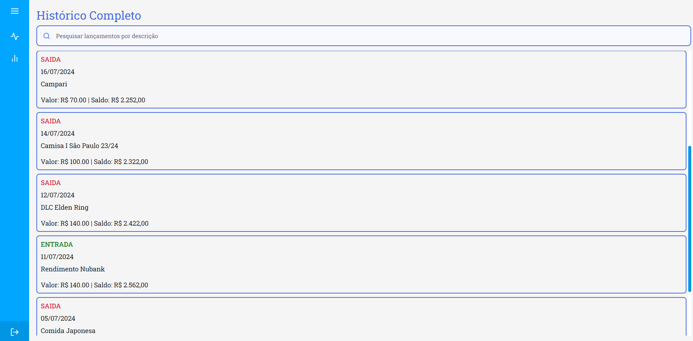

<h1 align="center"> Money Checking Web</h1>

  <a href="#-tecnologias">Tecnologias</a>&nbsp;&nbsp;&nbsp;|&nbsp;&nbsp;&nbsp;
  <a href="#-projeto">Projeto</a>&nbsp;&nbsp;&nbsp;|&nbsp;&nbsp;&nbsp;
  <a href="#-imagens">Imagens</a>&nbsp;&nbsp;&nbsp;

 

## Tecnologias

Esse projeto foi desenvolvido com as seguintes tecnologias:

- React JS
- Typescript
- Styled Components
- Git e Github

## Projeto

O aplicativo web Money Checking foi feito para concentrar os lançamentos feitos pelo aplicativo mobile em um lugar só. Na página web vai existir uma tela que carrega todos os lançamentos feitos independente do mês, mostrando o saldo geral de todos os lançamentos. Também vai existir uma tela de gráficos, para mostrar os lançamentos da melhor forma. Também existe uma página para atualizar os dados do perfil do usuário e da mesma forma que o aplicativo mobile, existe a função de login e de criar conta.

## Imagens

  
  
  
  
  

